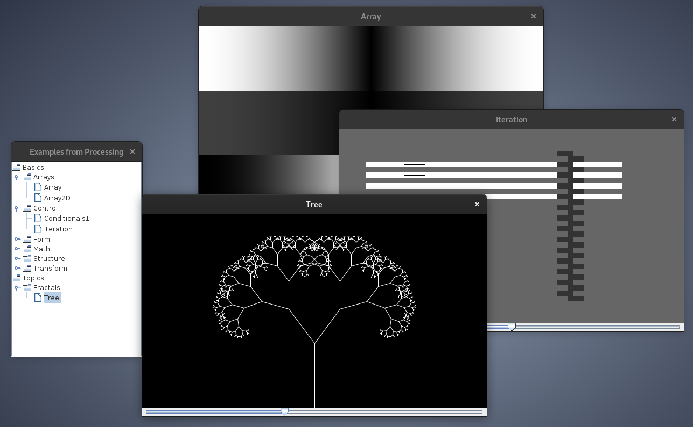

# LucreSwing

## statement

_in experimental (alpha) state_

Lucre2D is a Scala library which provides an expression based 2D graphics canvas for the [Lucre](https://codeberg.org/sciss/Lucre/) model.
It is (C)opyright 2022 by Hanns Holger Rutz. All rights reserved. The project is released under
the [GNU Affero General Public License](https://codeberg.org/sciss/Lucre2D/raw/main/LICENSE) v3+ and comes 
with absolutely no warranties. To contact the author, send an e-mail to `contact at sciss.de`.

## requirements / building

This project builds with sbt against Scala 2.12, 2.13, 3.x (JVM) and Scala 2.13 (JS).

To use the library in your project:

    "de.sciss" %% "lucre2d" % v

The current version `v` is `"0.1.0"`.

## running example

On the Desktop:

    sbt examplesJVM/run

Or to configure the Processing-inspired examples:

    sbt 'examplesJVM/runMain de.sciss.lucre.canvas.P5Examples --help'

Or to create a standalone:

   sbt examplesJVM/assembly
   java -Dsun.java2d.opengl=true -cp examples/jvm/Lucre2D.jar de.sciss.lucre.canvas.P5Examples --example tree --width 480 --height 480 --full-screen --animate --animate-tri --animate-fps 60

In the browser: to-do!

## contributing

Please see the file [CONTRIBUTING.md](CONTRIBUTING.md)

## notes

See `notes` directory for design process.
